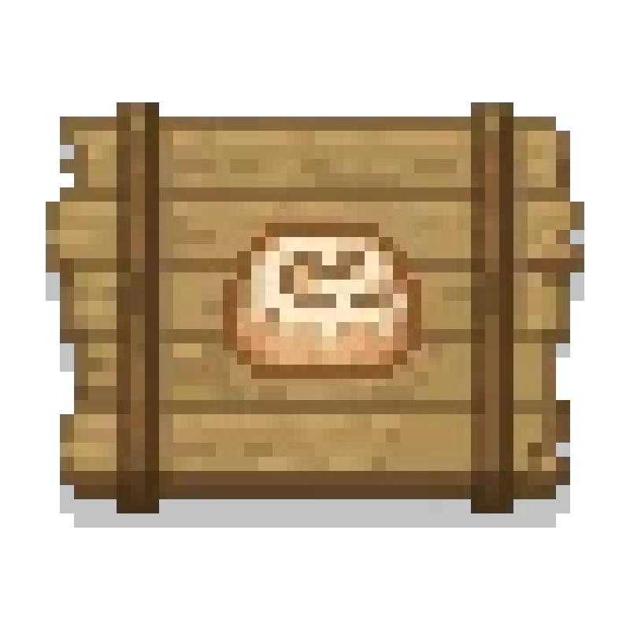

# Better than Bread

\

Better than Bread is an add-on for [Farmer's Delight](https://github.com/MehVahdJukaar/FarmersDelightRefabricated), which adds finger food pastries from all-around the world!

Sweet or salty, meat or not - everything's tasty and simple!

## Contributing

Contributions are always welcome!

See `contributing.md` for ways to get started.

## Related

You should also check out those!

- [Ocean's Delight by Scouter567](https://modrinth.com/mod/oceans-delight)
- [Expanded Delight by ianm1647](https://modrinth.com/mod/expanded-delight)
- [End's Delight by FoggyHillside](https://modrinth.com/mod/ends-delight)
- [Serene Seasons by Adubbz](https://modrinth.com/mod/serene-seasons)

